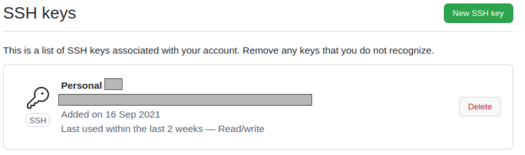
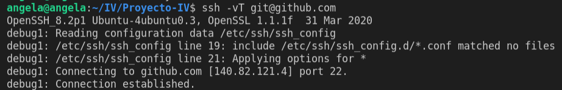

# Desarrollo de los objetivos

En este apartado se pretende justificar la realización de cada objetivo, además de reflejar los recursos que me han resultado útiles para poder llevar acabo este proyecto.

## **Objetivo 0 - Configuración del entorno de desarrollo** :hammer_and_wrench: :heavy_check_mark:
---
* **Creación de par de claves y subida de clave pública a GitHub** :key:
 
   Para ello, recurrí a la documentación oficial de GitHub. Únicamente seguí los pasos que allí se indican. A continuación, dejo los enlaces para cada una de las partes.
  
  **Generar las claves:**
  [GitHub Docs :paperclips:](https://docs.github.com/es/github/authenticating-to-github/connecting-to-github-with-ssh/generating-a-new-ssh-key-and-adding-it-to-the-ssh-agent)

  **Subida de clave pública a GitHub:**
  [GitHub Docs :paperclips:](https://docs.github.com/es/github/authenticating-to-github/connecting-to-github-with-ssh/adding-a-new-ssh-key-to-your-github-account)
  
  Captura de pantalla de la fecha en la que subí la clave pública generada a mi cuenta de GitHub:

  
 


  **Comandos útiles:**
 
  +  
    ```
  
    ssh -vT git@github.com
    ```
    Verifica la conexión por ssh al dominio correcto y que la autenticación de nuestro user es correcta.
    
    

  +
    ```
    git clone git@github.com:agr8/Proyecto-IV.git
    ```


   
* **Creación de rama específica para el objetivo 0**

  Uso del [plugin de git proporcionado :paperclips:](https://github.com/JJ/IV/blob/master/scripts/git-iv) para la asignatura. 
  
  
  + 
    ```
    ./git iv objetivo 0
    ```

    Crea la rama para este objetivo.
  + 
    ```
    ./git iv sube-objetivo 0
    ```
    Sube la rama al repositorio remoto.
* **Instalación de gh**
  
    En mi caso, trabajo sobre Ubuntu, por lo que, siguiendo las instrucciones de la documentación de [GitHub CLI :paperclips:](https://github.com/cli/cli/blob/trunk/docs/install_linux.md), únicamente he necesitado los siguientes comandos: 
  ```
  curl -fsSL https://cli.github.com/packages/githubcli-archive-keyring.gpg | sudo gpg --dearmor -o /usr/share/keyrings/githubcli-archive-keyring.gpg
  echo "deb [arch=$(dpkg --print-architecture) signed-by=/usr/share/keyrings/githubcli-archive-keyring.gpg] https://cli.github.com/packages stable main" | sudo tee /etc/apt/sources.list.d/github-cli.list > /dev/null 
  ```
    ```
    sudo apt update
    ```
    ```
    sudo apt install gh
    ```

* **Licencias**
  [GitHub Docs :paperclips:](https://docs.github.com/en/repositories/managing-your-repositorys-settings-and-features/customizing-your-repository/licensing-a-repository)

## Objetivo 1 - Estructura general y planificación del proyecto  :bookmark_tabs:

---
* **Metodología de Personas**
  
* **Historias de usuario y Milestones**

